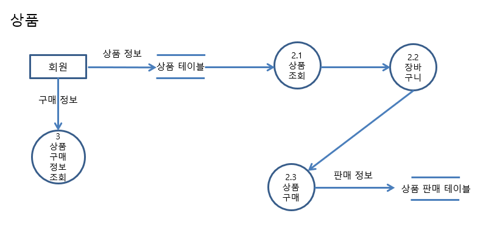
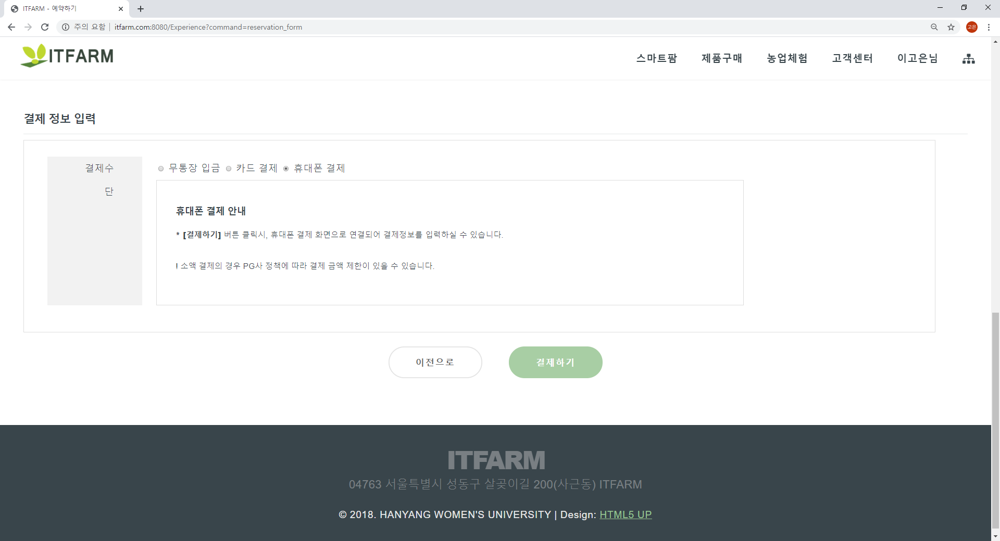
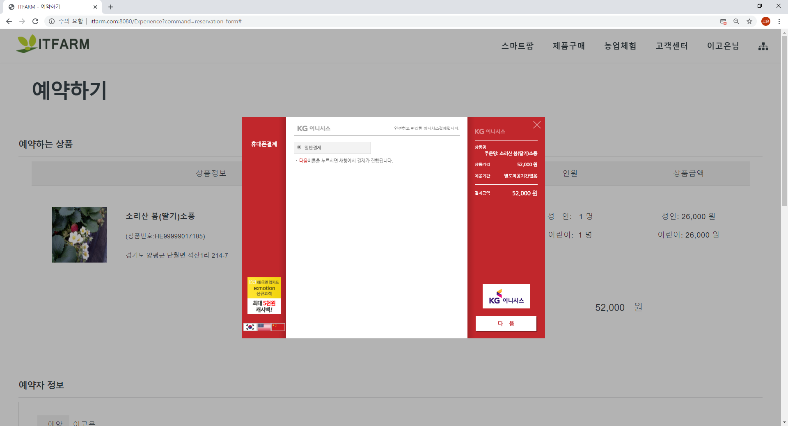

# ITFARM

## 목차

1. [프로젝트 개요](#1-프로젝트-개요)
2. [개발인원 및 기간](#2-개발-인원-및-기간)
3. [구현 목적](#3-구현-목적)
4. [개발 환경](#4-개발-환경)
5. [주요기능 및 사이트맵](#5-주요기능-및-사이트맵)
6. [역할 및 담당](#6-역할-및-담당)
7. [프로젝트 설계](#7-프로젝트-설계)
8. [프로젝트 주요기능](#8-프로젝트-주요기능)
9. [문제점 및 개선사항](#문제점-및-개선사항)
10. [성과](#성과)

## 1. 프로젝트 개요

`공공데이터 Open API`를 활용한 `체험 예약` & `상품 구매` 서비스

[top ▲](#itfarm)

## 2. 개발 인원 및 기간

- 개발인원: 4명
- 개발기간: 2018.03 ~ 2018.11 (8개월)

[top ▲](#itfarm)

## 3. 구현 목적

- 사용자는 편리하게 스마트팜 기기를 장바구니에 담아 `구매`
- 국가에서 제공하는 신뢰성 있는 공공데이터를 이용해 `농촌 체험을 예약`
- ‘ITFARM’은 농촌 체험 컨텐츠를 통해 `농촌 관심도 향상`의 기대효과를 얻을 수 있음

[top ▲](#itfarm)

## 4. 개발 환경

- OS : `window 10`
- Language : `JAVA`, `JavaScript`
- DataBase : `MySQL`
- api: `주소`, `결제`, `공공데이터`
- Library/Framework: `구글차트`, `jQuery`, `부트스트랩`

[top ▲](#itfarm)

## 5. 주요기능 및 사이트맵

### 5.1 주요기능

1. 체험예약
2. 상품구매
3. 관리자

### 5.2 사이트맵

- **사용자**

- **관리자**

[top ▲](#itfarm)

## 6. 역할 및 담당

- 사용자페이지(체험예약, 상품구매, 로그인/회원가입, 마이페이지, 장바구니)
- 관리자페이지 (회원관리, 제품관리, 주문관리, 체험관리, 예약관리, 통계)

[top ▲](#itfarm)

## 7. 프로젝트 설계

### 7.1 프로젝트 추진 과정

| 내용/일정         | 세부내용                                               |
| ----------------- | ------------------------------------------------------ |
| **프로젝트 계획** | 스마트팜과 농촌체험에 대한 전망성과 현재시장 수요 조사 |
|                   | 요구사항 수집 및 분석                                  |
|                   | 서비스 대상 선정 (페르소나, 타킷)                      |
|                   | 프로젝트 시나리오 작성                                 |
|                   | 벤치마킹 선정 및 차별성                                |
|                   | 핵심업무 작성 (IA)                                     |
|                   | 업무 흐름도 작성 (Usecase diagram)                     |
|                   | 스토리보드 작성 (UI)                                   |
| **설계**          | IA와 스토리보드를 참고하여 사이트 설계 및 디자인       |
|                   | 시스템 구성도 (System architecture) 작성               |
|                   | Data modeling (ERD) 데이터베이스 설계                  |
| **구현**          | 화면 구현                                              |
|                   | 기능 구현 (사용자, 관리자)                             |
| **유지보수**      | 기능 테스트                                            |
|                   | 캡스톤 디자인 최종 보고서 작성                         |

### 7.2 ERD

- `erwin`으로 작성

### 7.3 스토리보드

- `카카오 오븐`을 이용하여 제작 
- <a href="https://ovenapp.io/view/0Sl5Egj9oruJx4mfBCoMJpHgFIQE4fD0/daNds" target="_blank">스토리보드 테스트 가능한 링크</a>

![[ITFARM] main](document/storyboard.png)

### 7.4 DFD (일부)

#### 7.5 UML

- `StarUML` 로 작성

[top ▲](#itfarm)

## 8. 프로젝트 주요기능

### 8.1 사용자

1. ###### 체험예약

   

   - `공공데이터`를 활용하여 `체험 예약 서비스`를 `제공`

   

   

   - 날짜 및 인원 선택을 통해 예약 진행

   

   

   

   - 결제 페이지에서 `원하는 수단 선택` 후 `결제 진행`

   

   

   - `결제 api`를 통해 결제 진행

   

   

   

   - 예약된 내역 확인 가능

   - 날짜가 지난 예약은 취소 불가 처리

     

2. ###### 상품구매

   

   - 상세페이지에서 수량 확인 후 구매 진행

   

   

   - 장바구니에 담은 상품 구매 가능

   

   

   - 체험 예약과 마찬가지로 `카드 결제`와 `휴대폰 결제` 진행 가능

   

   

   - 마이페이지에서 구매내역 확인

   

3. ###### 멤버십 관련 기능

   

   - 내 활동과 관련된 내역 확인 가능

### 8.2 관리자

1. ###### 메인

   

   - 사이트 관련 현황을 확인 가능

     

2. ###### 회원관리

   

   - 회원 정보를 확인하고 강제 탈퇴 가능

   - 탈퇴된 회원은 개인정보를 지우고 아이디만 컬럼에 저장

     

3. ###### 상품관리

   

   - 주문에 관련된 검색 조건 선택 후 검색 가능

   - 주문 상태에 따라 무통장 입금 확인, 운송장 등록, 반품 승인/거절 처리 가능

     

   

   - 제품 관리 메뉴에서는 제품을 등록하고 수정 가능

   - 상세 설명 부분은 관리자가 작성한대로 줄바꿈을 처리

     

4. ###### 예약관리

   

   - 예약과 관련된 내용을 확인, 검색 가능

     

5. ###### 통계

   

   - 상품, 체험, 예약, 주문, 회원 통계를 확인 가능한 메뉴

   - 월별, 주별, 일별 통계를 확인 가능

   - `구글 차트` 라이브러리를 사용

     

   

   - 매출 내역을 표 형태로 확인 가능

   - 전주 대비 금주 매출 상승률 확인 가능

     

   

   - 매출 Top 10 상품 확인 가능

     

### 기타

1. ###### 에러 페이지 처리

[top ▲](#itfarm)

## 문제점 및 개선사항

- 로그인, 회원가입 시 보안 처리 안됨

- 트랜잭션 처리 없음

- 커넥션 풀 고려하지 못한 개발
- 비동기 처리가 필요한 부분에 적용하지 못함

[top ▲](#itfarm)

## 배운 점

- 졸업작품전 장려상

- 기획, 설계부터 개발까지 전과정 경험

[top ▲](#itfarm)